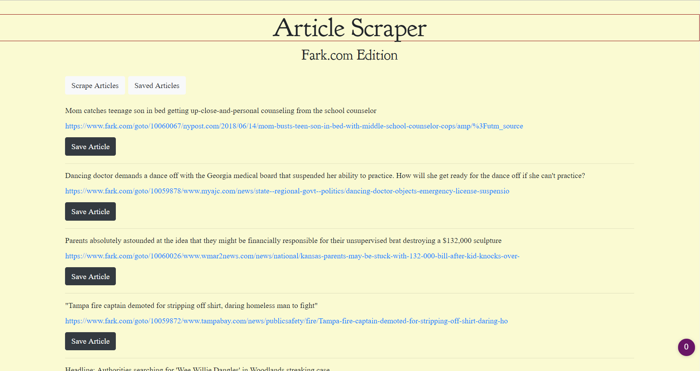

#
<h1>

Fark.com Article Scraper

</h1>

### The Fark.com Article Scraper scrapes articles and allows you to save (and soon add notes to) individual articles.  This website was built with HTML5, CSS, NodeJS, Axios, MongoDB, Mongoose, and Express-Handlebars.

---
[CLICK ME to see it in action](https://young-cliffs-38667.herokuapp.com/)
  

---
 

  

This Project was developed and is maintained by Daniel Olivas, to get help contact:  

me@danielolivas.net 
www.danielolivas.net 